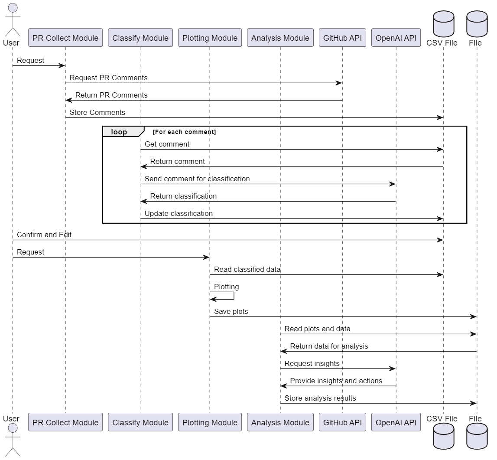

Dựa trên ý tưởng của bạn về việc tự động hóa việc thu thập và phân tích các bình luận trên Pull Request (PR) trên GitHub, dưới đây là một Requirement Definition chi tiết mà bạn có thể sử dụng để phát triển ứng dụng của mình. Bản mô tả này bao gồm các yêu cầu kỹ thuật, chức năng, và các yêu cầu không kỹ thuật.

### Requirement Definition cho Ứng Dụng Tự Động Hóa Quản Lý Comment trên GitHub PR

#### 1. Thu Thập Comment
**Mục đích:**
- Tự động lấy các bình luận từ các Pull Request trên các repository GitHub định trước.

**Yêu cầu chức năng:**
- Kết nối với GitHub API để truy xuất các bình luận từ PR.
- Xác thực và quản lý quyền truy cập thông qua OAuth hoặc token API.
- Lọc và thu thập bình luận dựa trên các tiêu chí nhất định (ví dụ: PR mở, PR đã đóng, v.v.).
- Lưu trữ dữ liệu bình luận vào file CSV với các trường thông tin như ID của bình luận, nội dung, tác giả, ngày giờ, v.v.

**Công nghệ sử dụng:**
- Ngôn ngữ lập trình: Python
- Thư viện: `requests` hoặc `PyGithub`

#### 2. Phân Loại Comment
**Mục đích:**
- Phân loại các bình luận theo danh mục và nguyên nhân gốc rễ dựa trên nội dung.

**Yêu cầu chức năng:**
- Định nghĩa các danh mục và nguyên nhân gốc rễ trong system prompt.
- Sử dụng OpenAI API để gửi bình luận và nhận phân loại dưới dạng JSON.
- Cập nhật file CSV với các trường phân loại.

**Công nghệ sử dụng:**
- OpenAI API
- Ngôn ngữ lập trình: Python
- Thư viện: `openai`, `pandas`

#### 3. Thống Kê Kết Quả Phân Loại
**Mục đích:**
- Vẽ biểu đồ thống kê để hiển thị phân bố của các danh mục bình luận.

**Yêu cầu chức năng:**
- Đọc dữ liệu từ file CSV.
- Sử dụng các thư viện thống kê của Python để tính toán và vẽ biểu đồ (ví dụ: số lượng bình luận theo danh mục).
- Xuất kết quả dưới dạng biểu đồ và báo cáo số liệu.

**Công nghệ sử dụng:**
- Ngôn ngữ lập trình: Python
- Thư viện: `matplotlib`, `pandas`

#### 4. Phân Tích Kết Quả Thống Kê và Đề Xuất Hành Động
**Mục đích:**
- Phân tích các kết quả thống kê và đề xuất các hành động tiếp theo.

**Yêu cầu chức năng:**
- Gửi các kết quả thống kê (ảnh biểu đồ và số liệu) cho OpenAI GPT.
- Sử dụng phản hồi từ OpenAI GPT để phân tích và đề xuất các hành động tiếp theo.
- Lưu các đề xuất hành động vào file.

**Công nghệ sử dụng:**
- OpenAI API
- Ngôn ngữ lập trình: Python
- Thư viện: `openai`, `pandas`, `matplotlib`

### Yêu Cầu Không Kỹ Thuật
- **Bảo mật:**

 Đảm bảo dữ liệu nhạy cảm và quyền truy cập được bảo vệ một cách nghiêm ngặt.
- **Hiệu suất:** Đảm bảo ứng dụng có thể xử lý một lượng lớn bình luận một cách hiệu quả.
- **Khả năng mở rộng:** Thiết kế ứng dụng có khả năng mở rộng để có thể thêm nhiều repository hoặc tính năng mới một cách dễ dàng.

Bạn có thể sử dụng Requirement Definition này như là khung sườn để phát triển và triển khai dự án của mình.

